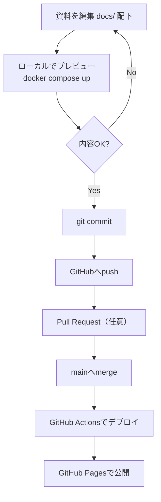

# 機能一覧

## 機能

- **資料サイト（MkDocs）**
  - `docs/` 配下の Markdown をサイト化
  - ナビゲーション（`mkdocs.yml`）で章立て管理
- **ローカルプレビュー**
  - Docker Compose で起動し、ホストに依存を入れない
- **GitHub Pages 公開**
  - GitHub Actions で自動デプロイ（`main` → `gh-pages`）
- **学習資料（Git / GitHub）**
  - 非エンジニア向けに「会話に必要な概念」を中心に整理
  - Gitとは / GitHubとは / 覚えるコマンド / 用語集
  - GitHub の画面メニュー（ヘッダー/リポジトリのタブ）を「役割」で整理

## 更新フロー（Mermaid）

